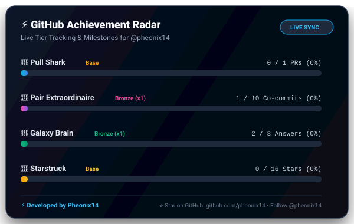

# ⚡ GitHub Achievement Radar Action

<p align="center">
  
</p>

<p align="center">
  <strong>Track real-time progress toward Silver, Gold, and Mythic GitHub Achievement Tiers (Pull Shark, Pair Extraordinaire, Galaxy Brain, Starstruck) and render glowing SVG progress cards for your Profile README.</strong>
</p>

<p align="center">
  <a href="https://github.com/pheonix14/github-achievement-radar/stargazers"></a>
  <a href="https://github.com/pheonix14"></a>
  <a href="https://github.com/pheonix14/github-achievement-radar/blob/main/LICENSE"></a>
</p>

---

## 🌟 Why This Exists

GitHub awards badges like **Pull Shark**, **Pair Extraordinaire**, **Galaxy Brain**, and **Starstruck**, but hides your exact progress counter. You never know how many more PRs or discussions you need to reach the **Gold (x3)** or **Mythic (x4)** tiers!

**GitHub Achievement Radar** solves this by:
1. Scanning your actual contributions via the GitHub API.
2. Calculating your exact percentage toward the next milestone.
3. Automatically generating a glassmorphic, cyber-glow SVG card.
4. Auto-committing the card to your repository or profile README!

---

## 🚀 Quickstart (Automated GitHub Workflow)

Create `.github/workflows/achievement-radar.yml` in your profile repository (e.g. `your-username/your-username` or any repo):

```yaml
name: Update Achievement Radar

on:
  schedule:
    - cron: '0 0 * * *' # Runs daily at midnight UTC
  workflow_dispatch: # Allows manual trigger anytime

permissions:
  contents: write

jobs:
  radar:
    runs-on: ubuntu-latest
    steps:
      - name: Checkout Repository
        uses: actions/checkout@v4

      - name: Generate Achievement Radar SVG
        uses: pheonix14/github-achievement-radar@v1.0.0
        with:
          github-token: ${{ secrets.GITHUB_TOKEN }}
          username: ${{ github.repository_owner }}
          output-path: 'achievement-radar.svg'

      - name: Commit and Push Badge
        run: |
          git config --global user.name "github-actions[bot]"
          git config --global user.email "github-actions[bot]@users.noreply.github.com"
          git add achievement-radar.svg
          git commit -m "chore: update live achievement radar [skip ci]" || exit 0
          git push
```

### Embed in Your README:
```markdown
<p align="center">
  
</p>
```

---

## ⚙️ Action Inputs & Outputs

### Inputs
| Input | Description | Default | Required |
| :--- | :--- | :--- | :--- |
| `github-token` | GitHub access token | `${{ github.token }}` | **Yes** |
| `username` | Target GitHub username | `${{ github.repository_owner }}` | No |
| `output-path` | Path to save the generated SVG | `achievement-radar.svg` | No |

### Outputs
| Output | Description |
| :--- | :--- |
| `radar-svg` | Path to generated SVG file |
| `pull-shark-progress` | Percentage progress to next Pull Shark tier |
| `pair-extraordinaire-progress` | Percentage progress to next Pair Extraordinaire tier |
| `galaxy-brain-progress` | Percentage progress to next Galaxy Brain tier |

---

## 🤝 Author & Credits

Developed with ❤️ by **[Pheonix14](https://github.com/pheonix14)**.

⭐ **If you love this tool, please consider:**
* **[Starring this repository](https://github.com/pheonix14/github-achievement-radar)**
* **[Following @pheonix14 on GitHub](https://github.com/pheonix14)**

Licensed under the [MIT License](LICENSE).
